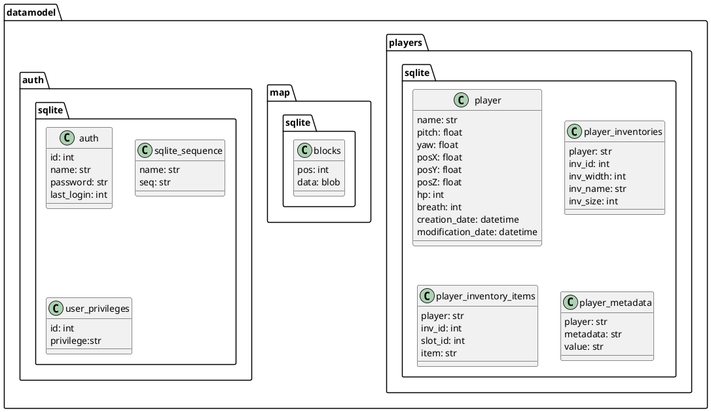

<span class="glitch__line glitch__line--first"></span>
<span class="glitch__line glitch__line--second"></span>
<h1 class="glitch glitch__color glitch__color--red">Gate Lock</h1>
<h1 class="glitch glitch__color glitch__color--green">Gate Lock</h1>
<h1 class="glitch glitch__color glitch__color--blue">Gate Lock</h1>
<h1 class="glitch glitch__color">Gate Lock</h1>
<br />
<br />


## Data exploration
there are 3 sqlite databases with the following schemata:

This looks like a savegame. There are other files with no real clues on what's going on. After some googleing it turns out to be a savegame for `minetest`, a minecraft clone based in the irrlicht engine, written in c++ with lua scripting.

## Setup
```bash
# install dependencies
sudo apt install build-essential libirrlicht-dev cmake libbz2-dev libpng-dev libjpeg-dev libxxf86vm-dev libgl1-mesa-dev libsqlite3-dev libogg-dev libvorbis-dev libopenal-dev libcurl4-gnutls-dev libfreetype6-dev zlib1g-dev libgmp-dev libjsoncpp-dev

# get the code
git clone --depth 1 https://github.com/minetest/minetest.git
cd minetest
# get the main game mode
git clone --depth 1 https://github.com/minetest/minetest_game.git games/minetest_game
# build
cmake . -DRUN_IN_PLACE=TRUE
make -j 8
# run
./bin/minetest
```

It seems to run great. after loading the savegame (by copying the folder into minetest/worlds) and reading the log, there are some mods missing: [Mesecons](https://github.com/minetest-mods/mesecons)

to install them:
```bash
rm mods/mods_here.txt
git clone https://github.com/minetest-mods/mesecons mods
./bin/minetest
```
## Solution
there is a locked door attached to some logic circuit.

after step by step reversing the circuit the _pattern_ is formatted as a [flag](../flags.html#80_gatelock) (`CTF{`\<pattern>`}`)

